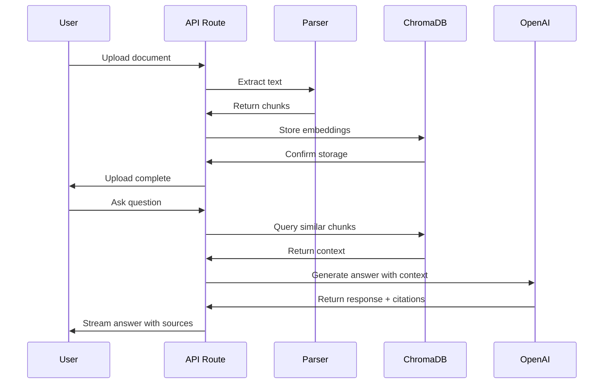
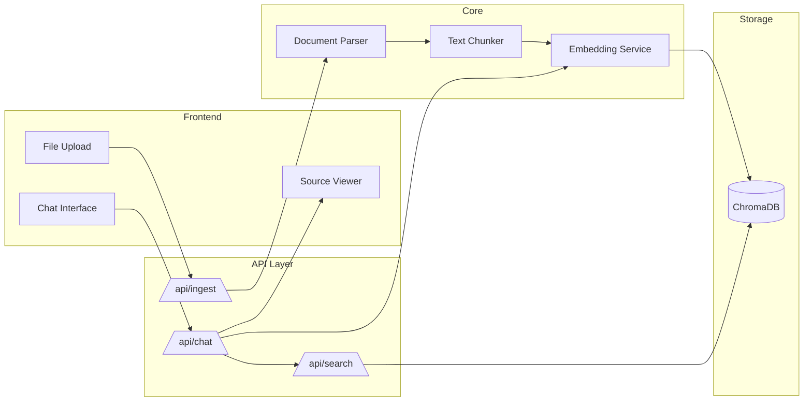

# RAG Docs Agent

A conversational AI agent that ingests documentation and codebases to answer questions with source-cited responses.

Built with **OpenAI Assistants API**, **ChromaDB**, **Next.js 14**, and **Vercel AI SDK**.

---

## 🏗️ Architecture

### System Context


### Data Flow


### Component Architecture


---

## 🚀 Quick Start

### Prerequisites
- Node.js 18+
- OpenAI API key

### Setup

```bash
# Clone and install
git clone <repo-url>
cd rag-docs-agent
npm install

# Environment
cp .env.example .env.local
# Add your OPENAI_API_KEY to .env.local

# Run tests
npm test

# Start dev server
npm run dev
```

---

## 🧪 Testing Strategy

| Test Type | Tool | Coverage |
|-----------|------|----------|
| Unit | Vitest | Services, utilities |
| Integration | Vitest + MSW | API routes, mocks |
| Component | Testing Library | React components |

All OpenAI calls are mocked with MSW for fast, deterministic tests.

---

## 📁 Project Structure

```
├── app/                    # Next.js App Router
│   ├── api/               # API routes
│   ├── components/        # React components
│   └── page.tsx           # Main chat UI
├── lib/                   # Core logic
│   ├── parser.ts          # Document parsing
│   ├── chunker.ts         # Text chunking
│   ├── embedder.ts        # Embedding service
│   └── chroma.ts          # ChromaDB client
├── tests/                 # Test files
│   ├── unit/             
│   ├── integration/
│   └── mocks/
└── types/                 # TypeScript types
```

---

## 🔧 Tech Stack

| Layer | Technology |
|-------|------------|
| Framework | Next.js 14 (App Router) |
| UI | React 18 + Tailwind CSS |
| AI SDK | Vercel AI SDK |
| LLM | OpenAI GPT-4o |
| Vector DB | ChromaDB |
| Testing | Vitest + MSW |
| Deployment | Vercel |

---

## 📝 License

MIT
