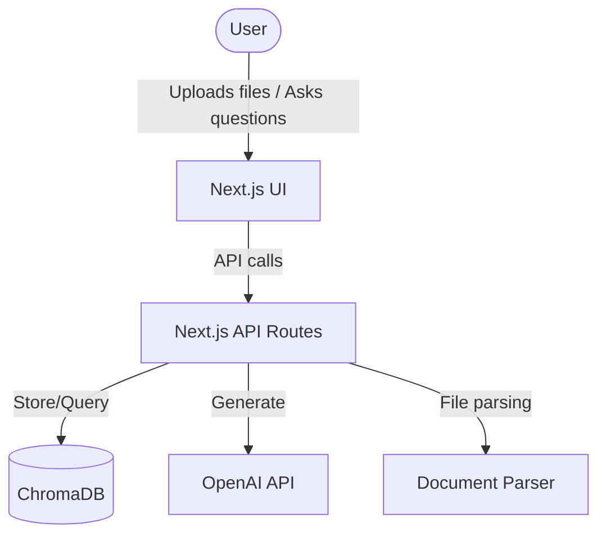
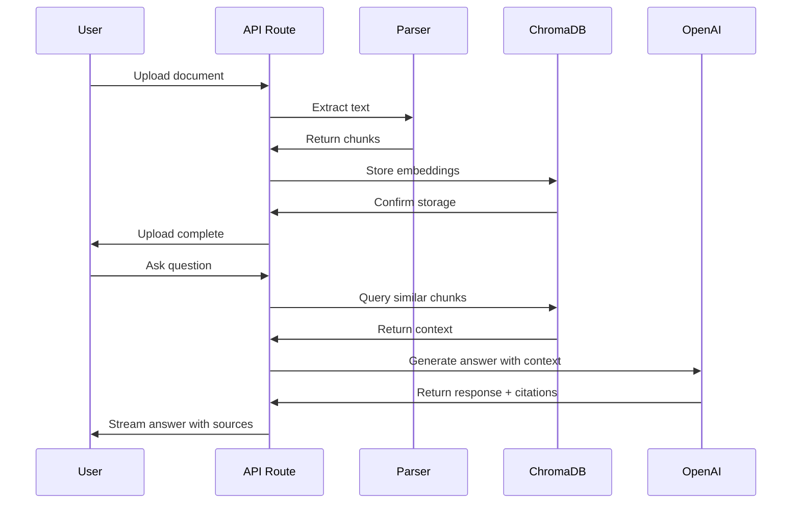
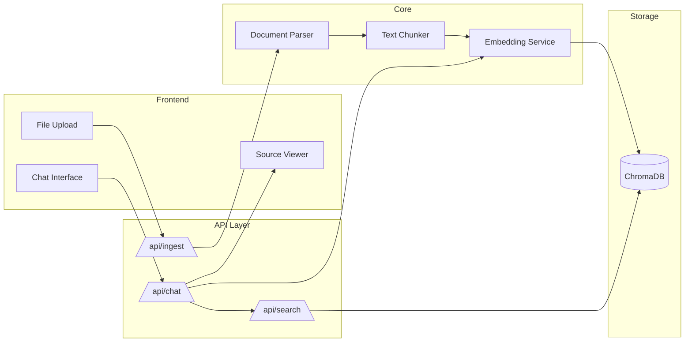

# RAG Docs Agent

A conversational AI agent that ingests documentation and codebases to answer questions with source-cited responses.

Built with **OpenAI Assistants API**, **ChromaDB**, **Next.js 14**, and **Vercel AI SDK**.

---

## 🏗️ Architecture

### System Context



### Data Flow



### Component Architecture



---

## 🚀 Quick Start

### Prerequisites

- Node.js 18+
- OpenAI API key

### Setup

```bash
# Clone and install
git clone <repo-url>
cd rag-docs-agent
npm install

# Environment
cp .env.example .env.local
# Add your OPENAI_API_KEY to .env.local

# Run tests
npm test

# Start dev server
npm run dev
```

---

## 🧪 Testing Strategy

| Test Type     | Tool            | Coverage Focus                   |
| ------------- | --------------- | ------------------------------- |
| Unit          | Vitest          | lib/ functions (parsers, etc.)   |
| Integration   | Vitest + MSW    | API routes, mocked services       |
| Component     | -               | React components (not tested)     |

All external API calls (OpenAI, ChromaDB) are mocked for fast, deterministic tests.

### Running Tests

```bash
# Run all tests
npm test

# Run tests once
npm test -- --run

# Run tests with coverage
npm run test:coverage

# Run tests with UI
npm run test:ui
```

---

## 📁 Project Structure

```
├── app/                    # Next.js App Router
│   ├── api/               # API routes
│   │   ├── ingest/        # Document ingestion endpoint
│   │   └── chat/          # Chat with RAG endpoint
│   ├── components/        # React components
│   │   ├── ChatInterface.tsx
│   │   └── FileUpload.tsx
│   └── layout.tsx         # Root layout
├── lib/                   # Core logic
│   ├── parser.ts          # Document parsing
│   ├── chunker.ts         # Text chunking
│   ├── embedder.ts        # Embedding service
│   └── chroma.ts          # ChromaDB client
├── tests/                 # Test files
│   ├── unit/              # Unit tests for lib functions
│   ├── integration/       # Integration tests for API routes
│   ├── mocks/             # Mocked services (MSW)
│   └── setup.ts           # Test setup
├── types/                 # TypeScript types
│   └── index.ts           # Shared type definitions
└── docs/                  # Architecture decisions (ADR)
```

---

## 📡 API Documentation

### POST /api/ingest

Ingests a markdown or text file into the vector database.

**Request:**
```bash
curl -X POST http://localhost:3000/api/ingest \
  -F "file=@document.md"
```

**Parameters:**
- `file` (File): The markdown or text file to ingest

**Response:**
```json
{
  "success": true,
  "chunkCount": 15
}
```

**Constraints:**
- Max file size: 10MB
- Allowed extensions: `.md`, `.txt`, `.markdown`, `.text`

### POST /api/chat

Answers questions using RAG (Retrieval-Augmented Generation).

**Request:**
```bash
curl -X POST http://localhost:3000/api/chat \
  -H "Content-Type: application/json" \
  -d '{
    "messages": [
      {"role": "user", "content": "How do I handle errors?"}
    ]
  }'
```

**Parameters:**
- `messages` (Array<{role: string, content: string}>): Conversation history

**Response:**
```json
{
  "response": "To handle errors in this code...",
  "sources": [
    {
      "id": "chunk-42",
      "content": "Error handling...",
      "metadata": {
        "source": "docs.md",
        "startLine": 15,
        "endLine": 20
      }
    }
  ]
}
```

---

## 🔧 Tech Stack

| Layer      | Technology              |
| ---------- | ----------------------- |
| Framework  | Next.js 14 (App Router) |
| UI         | React 18 + Tailwind CSS |
| AI SDK     | Vercel AI SDK           |
| LLM        | OpenAI GPT-4o           |
| Vector DB  | ChromaDB                |
| Testing    | Vitest + MSW            |
| Deployment | Vercel                  |

---

## 🚀 Deployment

### Vercel (Recommended)

1. Push your code to GitHub
2. Import the project in Vercel
3. Add environment variables:
   - `OPENAI_API_KEY`: Your OpenAI API key
   - `CHROMA_URL`: (Optional) ChromaDB server URL (defaults to localhost:8000)
   - `CHROMA_COLLECTION`: (Optional) Collection name (defaults to "documents")
4. Deploy!

### Docker

```bash
# Build image
docker build -t rag-docs-agent .

# Run container
docker run -p 3000:3000 \
  -e OPENAI_API_KEY=your-key \
  -e CHROMA_URL=http://chromadb:8000 \
  rag-docs-agent
```

### Manual Deployment

```bash
npm run build
npm start
```

The application will be available at `http://localhost:3000`

---

## 🔧 Troubleshooting

### ChromaDB Connection Issues

**Problem:** "Failed to connect to ChromaDB"

**Solutions:**
1. Ensure ChromaDB server is running: `docker run -p 8000:8000 chromadb/chroma`
2. Check the `CHROMA_URL` environment variable
3. Verify network connectivity if ChromaDB is remote

### OpenAI API Errors

**Problem:** "Insufficient quota" or "Invalid API key"

**Solutions:**
1. Verify your OpenAI API key is correct
2. Check your API quota at https://platform.openai.com/usage
3. Add a valid `OPENAI_API_KEY` to `.env.local`

### File Upload Failures

**Problem:** Files aren't uploading or showing errors

**Solutions:**
1. Ensure file is `.md` or `.txt` format
2. Check file size is under 10MB
3. Verify file encoding is UTF-8

### Test Failures

**Problem:** Tests failing with "module not found" errors

**Solutions:**
1. Run `npm install` to install dependencies
2. Ensure all dependencies are up to date: `npm update`
3. Clear cache: `rm -rf node_modules/.vite`

### No Search Results

**Problem:** Chat responses don't include relevant sources

**Solutions:**
1. Ensure documents have been ingested via /api/ingest
2. Check ChromaDB collection has data
3. Try adjusting your question to match document content

---

## 📝 License

MIT
